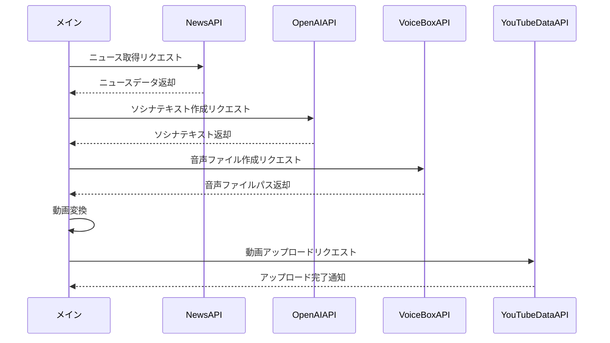

# SoshinaUploader
## 概要
最新のニュース

## シーケンス

```mermaid
sequenceDiagram
    participant Main as メイン
    participant NewsAPI as NewsAPI
    participant OpenAI as OpenAIAPI
    participant VoiceBox as VoiceBoxAPI
    participant YouTube as YouTubeDataAPI

    Main->>NewsAPI: ニュース取得リクエスト
    NewsAPI-->>Main: ニュースデータ返却
    Main->>OpenAI: ソシナテキスト作成リクエスト
    OpenAI-->>Main: ソシナテキスト返却
    Main->>VoiceBox: 音声ファイル作成リクエスト
    VoiceBox-->>Main: 音声ファイルパス返却

    Main->>Main: 動画変換

    Main->>YouTube: 動画アップロードリクエスト
    YouTube-->>Main: アップロード完了通知
```

## 記事

